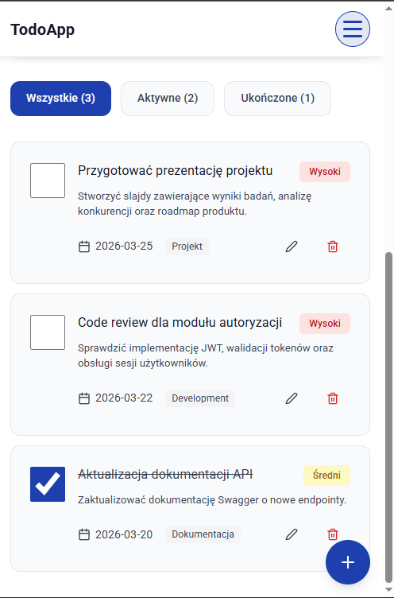
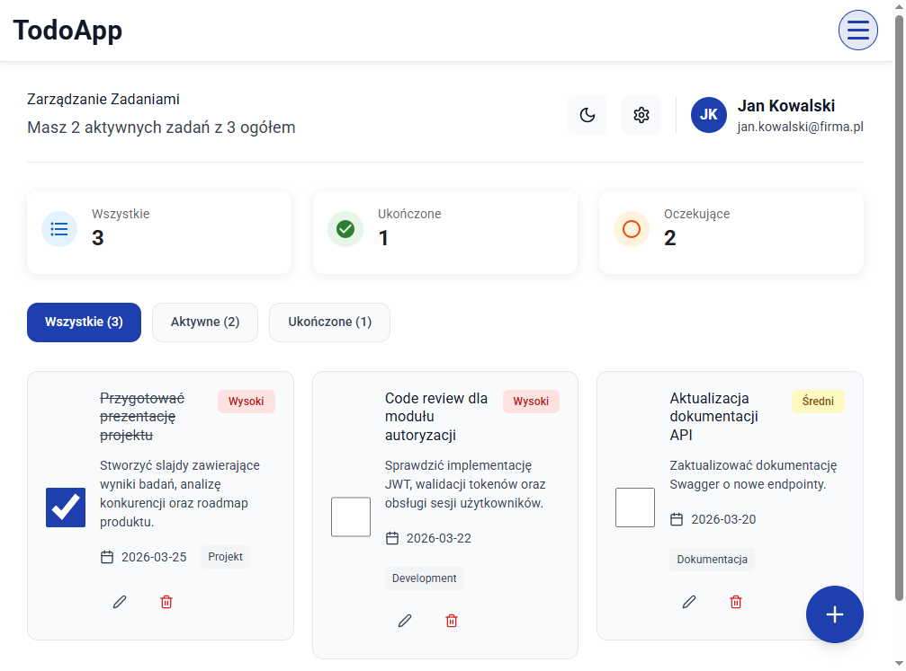
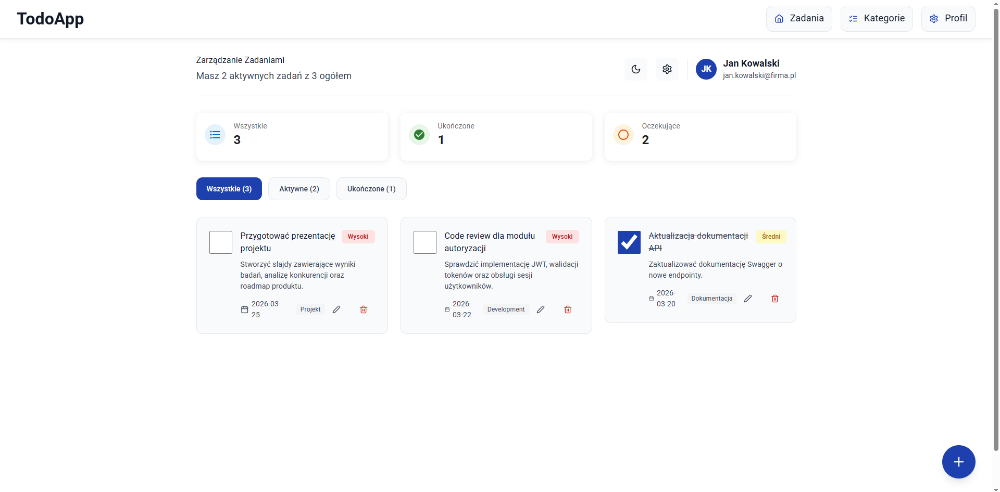
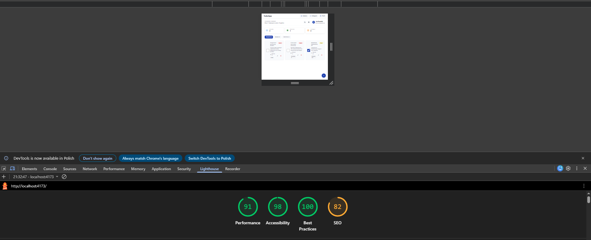

## Lab 6 – Responsive Design

W ramach laboratorium 6 aplikacja została rozbudowana o pełną responsywność zgodną z wymaganiami zadania. Implementacja została wykonana w podejściu **mobile-first**, a następnie rozszerzona o widoki tabletowe i desktopowe.

### Wprowadzone zmiany

- Zaimplementowano responsywną nawigację:
  - na urządzeniach mobilnych i tabletach działa jako hamburger menu,
  - na desktopie od szerokości `1024px` wyświetla się jako pełna pozioma nawigacja.
- Dodano obsługę stanu menu za pomocą `useState`.
- Dodano atrybuty dostępności dla menu:
  - `aria-label`,
  - `aria-expanded`,
  - `aria-controls`.
- Poprawiono widoczność przycisku hamburgera na urządzeniach mobilnych.
- Wprowadzono układ zgodny z breakpointami:
  - mobile: `< 768px`,
  - tablet: `768px – 1024px`,
  - desktop: `> 1024px`.
- Zastosowano responsywną siatkę zadań:
  - 1 kolumna na mobile,
  - 2 kolumny na tablecie,
  - 3 kolumny na desktopie.
- Dodano płynną typografię z wykorzystaniem `clamp()`.
- Poprawiono responsywność komponentów formularza i kart zadań.
- Poprawiono minimalne obszary klikalne elementów interaktywnych do minimum `44x44px`.
- Dodano `aspect-ratio` oraz `object-fit` dla elementów graficznych kart.
- Dodano style dla wydruku przez `@media print`.
- Poprawiono dostępność aplikacji pod kątem Lighthouse:
  - semantyczne przyciski,
  - etykiety formularzy,
  - poprawione kontrasty,
  - ukryte nagłówki pomocnicze dla czytników ekranu.
- Dodano testy responsywności wykonane w Chrome DevTools oraz audyt Lighthouse.

---

## Breakpointy

| Zakres  |        Szerokość | Układ     | Nawigacja               |
| ------- | ---------------: | --------- | ----------------------- |
| Mobile  |        `< 768px` | 1 kolumna | Hamburger menu          |
| Tablet  | `768px – 1024px` | 2 kolumny | Hamburger menu          |
| Desktop |       `> 1024px` | 3 kolumny | Pełna pozioma nawigacja |

---

## Testy responsywności

Responsywność aplikacji została sprawdzona dla kilku szerokości ekranu zgodnych z wymaganiami laboratorium.

### Widok tabletowy – 768px

### Widok desktopowy – 1024px

### Widok desktopowy – powyżej 1024px

---

## Lighthouse

Audyt Lighthouse został wykonany na produkcyjnym buildzie aplikacji.

### Podsumowanie Lab 6

Aplikacja spełnia wymagania laboratorium 6 w zakresie responsywnego interfejsu użytkownika.
Najważniejsze elementy, które zostały zaimplementowane, to:

podejście mobile-first,
breakpointy dla mobile, tablet i desktop,
hamburger menu z obsługą stanu,
responsywna siatka kart,
płynna typografia,
poprawione touch targety,
podstawowe usprawnienia dostępności,
style wydruku,
testy w Lighthouse i Chrome DevTools.
