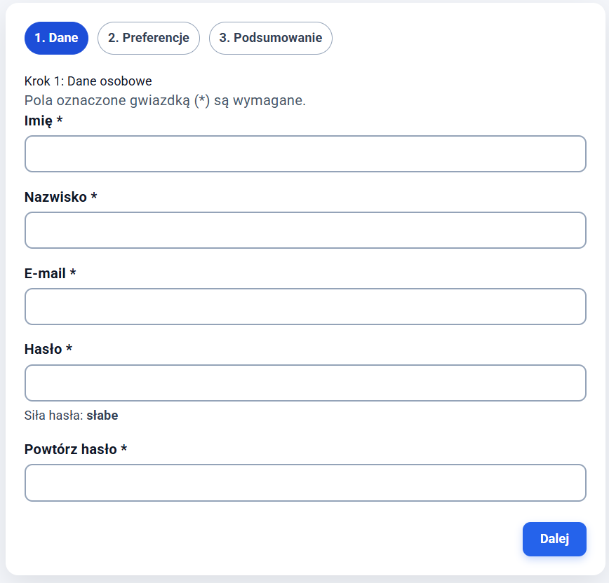
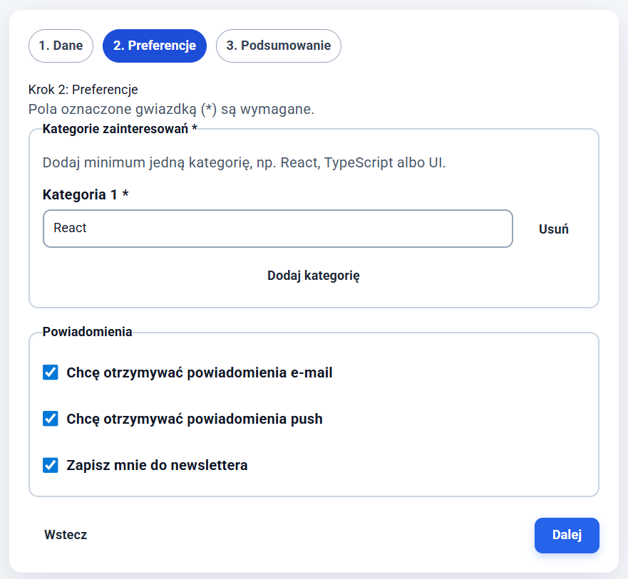
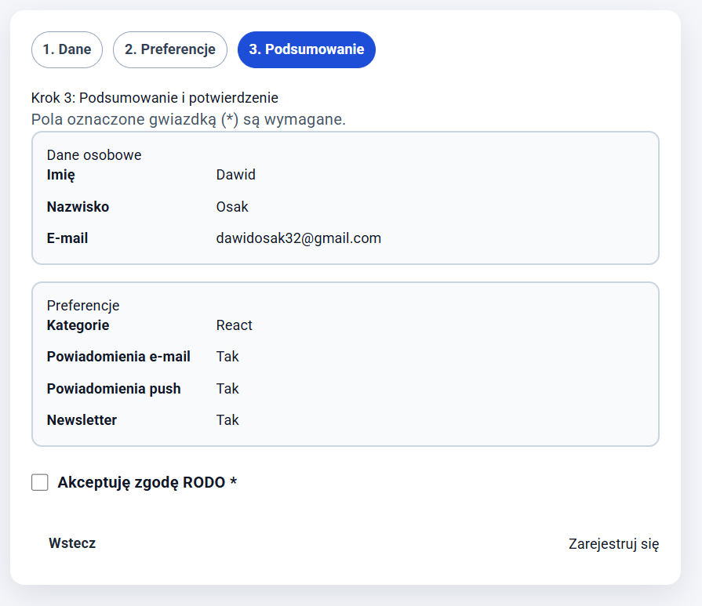
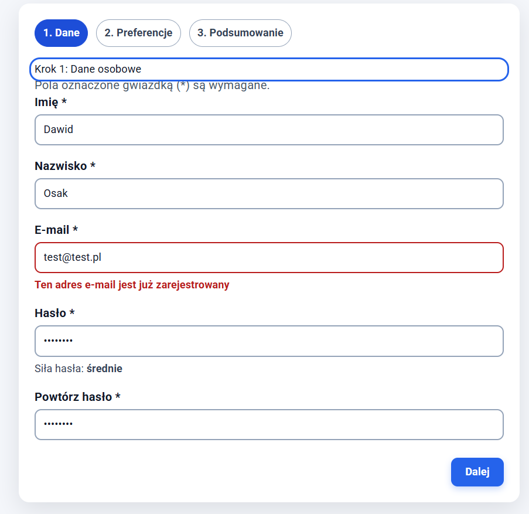
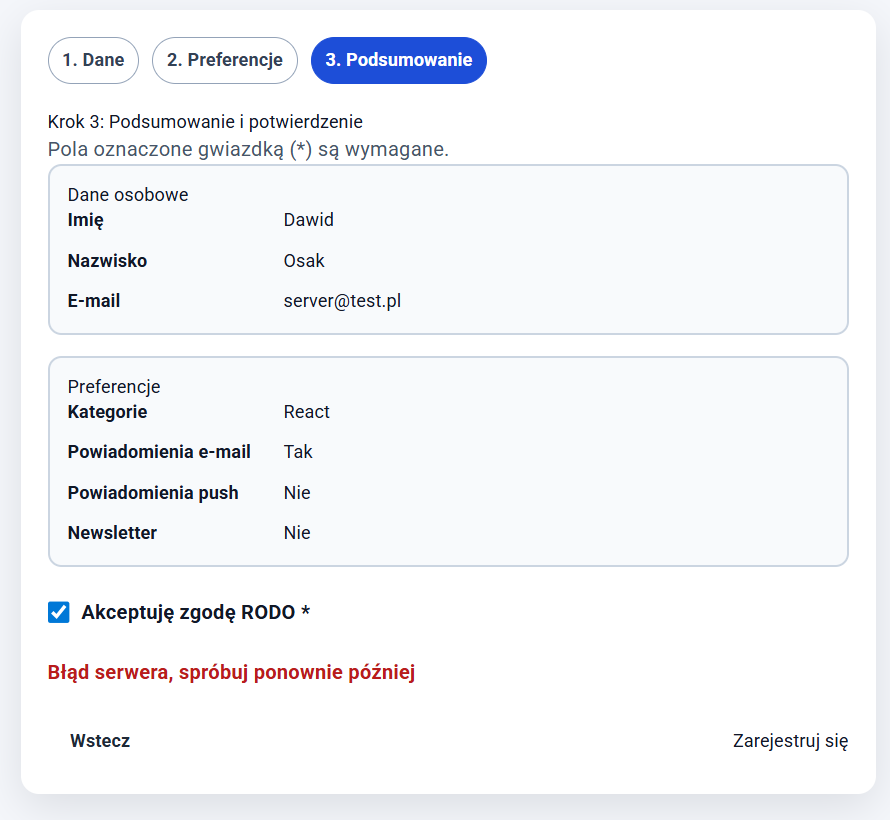

# Laboratorium 7 — Formularze i walidacja danych

Projekt został rozszerzony o wieloetapowy formularz rejestracji wykonany w React z wykorzystaniem **React Hook Form**, **Zod** oraz zasad dostępności **WCAG 2.1 AA**.

Formularz jest dostępny pod trasą:

```txt
/registration
```

## Cel zadania

Celem laboratorium było przygotowanie formularza rejestracyjnego podzielonego na 3 kroki, w którym dane są walidowane osobnymi schematami Zod, przechowywane pomiędzy krokami i wysyłane jednym żądaniem po potwierdzeniu w ostatnim kroku.

W projekcie zaimplementowano:

- formularz wieloetapowy,
- walidację danych za pomocą Zod,
- obsługę formularza przez React Hook Form,
- wskaźnik siły hasła,
- dynamiczne kategorie z `useFieldArray`,
- checkboxy obsługiwane przez `Controller`,
- obsługę błędów serwera przez `setError`,
- podstawowe wymagania dostępności WCAG,
- zachowanie danych przy przechodzeniu między krokami.

## Użyte technologie

```txt
React
TypeScript
React Hook Form
Zod
@hookform/resolvers
CSS
```

## Struktura dodanej funkcjonalności

Funkcjonalność rejestracji została wydzielona do osobnego modułu:

```txt
src/app/features/registration/
  api/
    registerUser.ts
  components/
    Form.css
    Form.tsx
    MultiStepRegistration.tsx
    PersonalData.tsx
    Preferences.tsx
    Summary.tsx
  schemas/
    registrationSchemas.ts
  types/
  index.ts
```

Dodatkowo dodano ekran:

```txt
src/app/screens/Registration.tsx
```

oraz trasę:

```txt
/registration
```

## Krok 1 — Dane osobowe

Pierwszy krok formularza zbiera podstawowe dane użytkownika:

- imię,
- nazwisko,
- adres e-mail,
- hasło,
- potwierdzenie hasła.

Dane są walidowane za pomocą schematu `step1Schema` z biblioteki Zod.

Zaimplementowane reguły walidacji:

| Pole              | Reguła                                 |
| ----------------- | -------------------------------------- |
| `firstName`       | minimum 2 znaki                        |
| `lastName`        | minimum 2 znaki                        |
| `email`           | poprawny format adresu e-mail          |
| `password`        | minimum 8 znaków, wielka litera, cyfra |
| `confirmPassword` | zgodność z hasłem przez `refine()`     |

Dodatkowo pod polem hasła wyświetlany jest wskaźnik siły hasła:

- słabe,
- średnie,
- silne.



## Krok 2 — Preferencje

Drugi krok formularza odpowiada za preferencje użytkownika.

Zaimplementowano pola:

- dynamiczna lista kategorii,
- powiadomienia e-mail,
- powiadomienia push,
- newsletter.

Kategorie są obsługiwane przez `useFieldArray`, dzięki czemu użytkownik może dodawać i usuwać pozycje. Formularz wymaga podania co najmniej jednej kategorii.

Checkboxy powiadomień zostały obsłużone przez `Controller`, zgodnie z wymaganiami zadania.



## Krok 3 — Podsumowanie i potwierdzenie

Trzeci krok pokazuje podsumowanie danych zebranych w krokach 1 i 2.

Na tym etapie użytkownik musi zaakceptować zgodę RODO. Dopiero po jej zaznaczeniu można wysłać formularz.

Po kliknięciu przycisku `Zarejestruj się` dane są agregowane do jednego obiektu i przekazywane do funkcji `registerUser()`.



## Obsługa błędów serwera

W projekcie przygotowano mock funkcji `registerUser()`, który symuluje odpowiedzi serwera.

### Błąd 409 — zajęty adres e-mail

Jeżeli użytkownik wpisze adres:

```txt
test@test.pl
```

funkcja `registerUser()` zwraca symulowany błąd `409`.

W takim przypadku formularz:

1. wraca do kroku 1,
2. ustawia błąd na polu `email` przez `setError`,
3. wyświetla komunikat, że adres e-mail jest już zarejestrowany.



### Błąd 500 — błąd serwera

Jeżeli użytkownik wpisze adres:

```txt
server@test.pl
```

funkcja `registerUser()` zwraca symulowany błąd `500`.

W takim przypadku formularz pozostaje w kroku 3 i pokazuje ogólny błąd serwera ustawiony przez:

```ts
setError("root.serverError", {
  type: "server",
  message: "Błąd serwera, spróbuj ponownie później",
});
```



## Dostępność WCAG

W formularzu uwzględniono wymagania dostępności:

- każde pole posiada `label` powiązany z `input`,
- błędy są powiązane z polami przez `aria-describedby`,
- błędne pola mają ustawiane `aria-invalid`,
- komunikaty błędów używają `role="alert"`,
- aktywny krok ma `aria-current="step"`,
- po zmianie kroku focus przenosi się na nagłówek aktualnego kroku,
- przyciski mają widoczny focus ring,
- podczas wysyłania formularza przyciski mają `disabled` oraz `aria-busy`,
- formularz nie opiera się wyłącznie na placeholderach.

## Zachowanie danych między krokami

Dane z kroków 1 i 2 są przechowywane w komponencie nadrzędnym `MultiStepRegistration`.

Dzięki temu po przejściu do kolejnego kroku oraz powrocie do poprzedniego wpisane dane nie znikają.

Do przechowywania danych użyto stanu:

```ts
const [formData, setFormData] = useState<FormDataState>({});
```

## Walidacja Zod i typowanie

Każdy krok formularza posiada własny schemat walidacji:

```txt
step1Schema
step2Schema
step3Schema
```

Typy danych są generowane bezpośrednio ze schematów Zod przez:

```ts
z.infer<typeof schema>;
```

Dzięki temu typy formularza są spójne z regułami walidacji.

## React Hook Form API

W projekcie wykorzystano wymagane elementy API React Hook Form:

| API             | Zastosowanie                              |
| --------------- | ----------------------------------------- |
| `useForm`       | obsługa każdego kroku formularza          |
| `register`      | standardowe pola tekstowe i checkbox RODO |
| `Controller`    | checkboxy powiadomień                     |
| `useFieldArray` | dynamiczne kategorie                      |
| `watch`         | wskaźnik siły hasła                       |
| `setError`      | obsługa błędów serwera                    |
| `handleSubmit`  | walidacja i wysyłka danych                |

## Jak uruchomić projekt

Instalacja zależności:

```bash
npm install
```

Uruchomienie aplikacji:

```bash
npm run dev
```

Następnie należy wejść w przeglądarce na trasę:

```txt
/registration
```

## Scenariusze testowe

### Poprawna rejestracja

Przykładowe dane:

```txt
Imię: Jan
Nazwisko: Kowalski
E-mail: jan@test.pl
Hasło: Test1234
Powtórz hasło: Test1234
Kategoria: React
RODO: zaznaczone
```

Efekt: formularz zostaje wysłany poprawnie, a użytkownik widzi komunikat o powodzeniu rejestracji.

### Test błędu 409

```txt
E-mail: test@test.pl
```

Efekt: formularz wraca do kroku 1 i pokazuje błąd przy polu e-mail.

### Test błędu 500

```txt
E-mail: server@test.pl
```

Efekt: formularz pozostaje w kroku 3 i pokazuje ogólny błąd serwera.

### Test walidacji hasła

Niepoprawne hasło:

```txt
test
```

Efekt: formularz pokazuje błędy dotyczące długości hasła, wielkiej litery i cyfry.

Poprawne hasło:

```txt
Test1234
```

Efekt: hasło przechodzi walidację.

## Podsumowanie wykonania

W ramach zadania wykonano kompletny formularz rejestracji zgodny z wymaganiami laboratorium:

- formularz ma 3 kroki,
- dane są walidowane osobnymi schematami Zod,
- dane nie znikają przy cofaniu,
- submit odbywa się dopiero w kroku 3,
- obsłużono błędy 409 i 500,
- zastosowano wymagane elementy React Hook Form,
- dodano podstawową dostępność WCAG,
- dodano zrzuty ekranu prezentujące działanie formularza.
