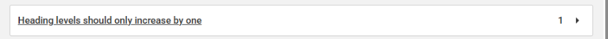
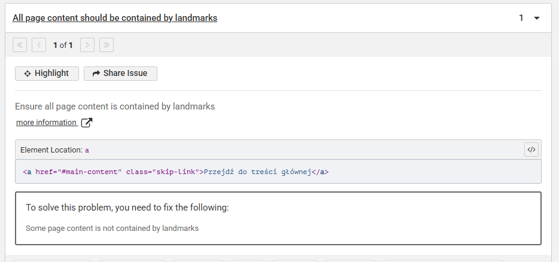
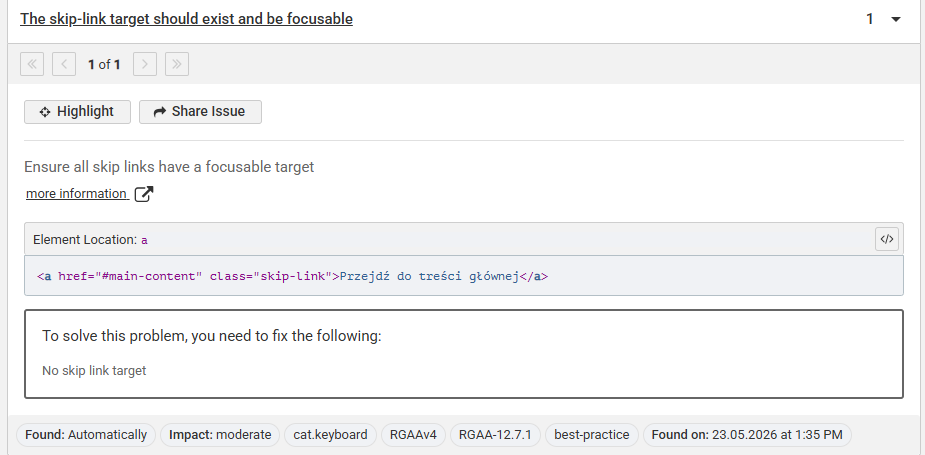
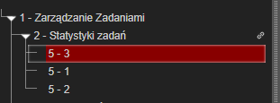

# Audyt dostępności WCAG — TodoApp

**Projekt:** TodoApp  
**Standard:** WCAG 2.1 AA  
**Audytowana strona:** `http://localhost:4173`  
**Tryb testu:** produkcyjny build aplikacji uruchomiony przez Vite Preview  
**Narzędzia:** Lighthouse, axe DevTools GUI, pa11y, NVDA, test klawiaturą, WebAIM Contrast Checker

---

## 1. Podsumowanie audytu

Celem audytu było sprawdzenie dostępności aplikacji TodoApp po wdrożeniu poprawek zgodnych z WCAG 2.1 AA. Audyt objął automatyczne narzędzia, test manualny klawiaturą, test czytnikiem ekranu oraz ręczną weryfikację kontrastu.

### Wyniki ogólne

| Obszar                   | Wynik                                     |
| ------------------------ | ----------------------------------------- |
| Lighthouse Accessibility | 96 / 100                                  |
| axe DevTools GUI         | 3 problemy typu Moderate przed poprawkami |
| pa11y WCAG2AA            | No issues found                           |
| Test klawiaturą          | PASS                                      |
| Test NVDA                | PASS                                      |
| Test kontrastu           | PASS dla 5 / 5 elementów                  |

---

## 2. Lighthouse

Audyt Lighthouse wykonano dla produkcyjnej wersji aplikacji.

### Wyniki

| Kategoria      | Wynik |
| -------------- | ----: |
| Performance    |    87 |
| Accessibility  |    96 |
| Best Practices |    81 |
| SEO            |    82 |

### Pliki raportu

```txt
/reports/lighthouse-accessibilty.report.html
/reports/lighthouse-accessibilty.report.json
```

---

## 3. axe DevTools GUI

Audyt wykonano za pomocą rozszerzenia **axe DevTools GUI** w Chrome DevTools dla strony głównej aplikacji TodoApp. Narzędzie wykryło 3 problemy typu **Moderate**. Dodatkowo struktura nagłówków została zweryfikowana wtyczką **HeadingsMap**.

---

### 3.1. Heading levels should only increase by one

**Błąd:**  
Struktura nagłówków przeskakiwała poziomy. W aplikacji występowała kolejność `h1 -> h2 -> h5`, co zaburzało logiczną strukturę dokumentu dla technologii asystujących.

**Zrzut błędu:**



**Naprawa:**  
Liczby w kartach statystyk nie powinny być nagłówkami, ponieważ są wartościami liczbowymi, a nie tytułami sekcji. Elementy oznaczone jako `h5` zostały zamienione na zwykłe elementy tekstowe.

```tsx
// Przed
<h5 className="stat-card__value">3</h5>

// Po
<p className="stat-card__value">3</p>
```

**Status:** Naprawione

---

### 3.2. All page content should be contained by landmarks

**Błąd:**  
Część zawartości strony znajdowała się poza semantycznymi landmarkami HTML. Problem dotyczył między innymi skip linka oraz struktury layoutu.

**Zrzut błędu:**



**Naprawa:**  
Dodano wspólny komponent `Layout`, w którym nawigacja znajduje się w `header`, a główna zawartość aplikacji w `main`.

```tsx
<header className="app-header">
  <a href="#main-content" className="skip-link">
    Przejdź do treści głównej
  </a>

  <Nav />
</header>

<main id="main-content" tabIndex={-1}>
  <Outlet />
</main>
```

**Status:** Naprawione

---

### 3.3. The skip-link target should exist and be focusable

**Błąd:**  
Skip link wskazywał na `#main-content`, ale w wyrenderowanym DOM nie było poprawnego elementu docelowego. Powodem było to, że komponent `Layout` z elementem `main` nie był używany jako główny wrapper routingu.

**Zrzut błędu:**



**Naprawa:**  
Komponent `Layout` został podpięty jako nadrzędny element w konfiguracji routingu. Dzięki temu każda podstrona renderuje się wewnątrz focusowalnego elementu `main`.

```tsx
export const router = createBrowserRouter([
  {
    path: "/",
    Component: Layout,
    children: [
      {
        index: true,
        Component: Lab4Dashboard,
      },
      {
        path: "todos",
        Component: Lab4Dashboard,
      },
      {
        path: "filter",
        Component: FilterSort,
      },
      {
        path: "task/:id",
        Component: TaskDetails,
      },
      {
        path: "add-task",
        Component: Lab4AddTask,
      },
      {
        path: "settings",
        Component: SettingsHiFi,
      },
      {
        path: "registration",
        Component: Registration,
      },
    ],
  },
]);
```

Dodatkowo usunięto zduplikowany layout z ekranu dashboardu, który powodował podwójne renderowanie nawigacji.

**Status:** Naprawione

---

### 3.4. HeadingsMap — niespójna struktura nagłówków

**Błąd:**  
Wtyczka HeadingsMap potwierdziła niespójną strukturę nagłówków `1 -> 2 -> 5`. Po nagłówku drugiego poziomu następował od razu nagłówek piątego poziomu.

**Zrzut błędu:**



**Naprawa:**  
Wartości liczbowe w statystykach zostały usunięte ze struktury nagłówków. Dzięki temu mapa nagłówków opisuje realną strukturę treści, a nie elementy czysto wizualne.

```tsx
// Przed
<h5>{totalTasks}</h5>
<h5>{completedTasks}</h5>
<h5>{pendingTasks}</h5>

// Po
<p>{totalTasks}</p>
<p>{completedTasks}</p>
<p>{pendingTasks}</p>
```

**Status:** Naprawione

---

## 4. pa11y

Audyt pa11y wykonano z ustawieniem standardu WCAG2AA.

```bash
npx pa11y http://localhost:4173 --standard WCAG2AA
```

### Wynik

```txt
Running Pa11y on URL http://localhost:4173

No issues found!
```

**Status:** PASS

---

## 5. Test klawiaturą

Test wykonano bez użycia myszy, korzystając z klawiszy `Tab`, `Shift + Tab`, `Enter`, `Spacja` oraz `Esc`.

### Obserwacje

- Fokus przechodzi po elementach w logicznej kolejności.
- Fokus jest widoczny na przyciskach, linkach i polach formularza.
- Skip link poprawnie przenosi do `#main-content`.
- Nie wykryto pułapki fokusu.

**Status:** PASS

---

## 6. Test NVDA

Test wykonano w przeglądarce Chrome z użyciem czytnika ekranu **NVDA**.

### Obserwacje

- NVDA poprawnie odczytuje główną nawigację aplikacji oraz przyciski: „Zadania”, „Kategorie”, „Profil”.
- Skip link „Przejdź do treści głównej” jest odczytywany i pozwala ominąć nawigację.
- Główna treść strony, nagłówki oraz karty zadań są odczytywane w logicznej kolejności.
- Przyciski ikonowe posiadają zrozumiałe nazwy dostępne, więc NVDA nie odczytuje ich jako anonimowych przycisków.

**Status:** PASS

---

## 7. Ręczna weryfikacja kontrastu

Test kontrastu wykonano ręcznie za pomocą narzędzia WebAIM Contrast Checker:

```txt
https://webaim.org/resources/contrastchecker/
```

Wszystkie sprawdzone elementy spełniają wymagania WCAG 2.1 AA dla tekstu, czyli minimum `4.5:1` dla standardowego tekstu.

| #   | Element                          | Contrast ratio | Status |
| --- | -------------------------------- | -------------: | ------ |
| 1   | Tytuł aplikacji „TodoApp”        |           21:1 | PASS   |
| 2   | Nagłówek „Zarządzanie zadaniami” |        17.73:1 | PASS   |
| 3   | Przycisk filtra „Wszystkie”      |         8.72:1 | PASS   |
| 4   | Tekst w karcie zadania           |        16.95:1 | PASS   |
| 5   | Badge priorytetu „Wysoki”        |         5.29:1 | PASS   |

---

## 8. Tabela błędów i obserwacji WCAG

| #   | Błąd / obserwacja                                  | Kryterium WCAG               | Poziom | Priorytet | Zalecenie / naprawa                                               | Status        |
| --- | -------------------------------------------------- | ---------------------------- | ------ | --------- | ----------------------------------------------------------------- | ------------- |
| 1   | Przeskok poziomów nagłówków `h1 -> h2 -> h5`       | 1.3.1 Info and Relationships | A      | P1        | Zamienić wartości statystyk z `h5` na zwykły tekst                | Naprawione    |
| 2   | Treść strony poza landmarkami                      | 1.3.1 Info and Relationships | A      | P1        | Dodać semantyczny layout z `header` i `main`                      | Naprawione    |
| 3   | Skip link bez focusowalnego celu                   | 2.4.1 Bypass Blocks          | A      | P1        | Dodać `main id="main-content" tabIndex={-1}`                      | Naprawione    |
| 4   | Layout z `main-content` nie był używany w routingu | 2.4.1 Bypass Blocks          | A      | P1        | Podpiąć `Layout` jako główny wrapper tras                         | Naprawione    |
| 5   | Podwójne renderowanie nawigacji                    | 1.3.1 Info and Relationships | A      | P2        | Usunąć stary `AppLayout` z ekranu dashboardu                      | Naprawione    |
| 6   | Struktura nagłówków niespójna według HeadingsMap   | 1.3.1 Info and Relationships | A      | P1        | Usunąć elementy statystyczne ze struktury nagłówków               | Naprawione    |
| 7   | Konieczność weryfikacji dostępności klawiaturą     | 2.1.1 Keyboard               | A      | P2        | Przetestować aplikację klawiszami `Tab`, `Enter`, `Spacja`, `Esc` | Zweryfikowane |
| 8   | Konieczność weryfikacji czytnikiem ekranu          | 4.1.2 Name, Role, Value      | A      | P2        | Przetestować aplikację w NVDA                                     | Zweryfikowane |
| 9   | Konieczność ręcznej weryfikacji kontrastu          | 1.4.3 Contrast Minimum       | AA     | P2        | Sprawdzić minimum 5 elementów tekstowych                          | Zweryfikowane |
| 10  | pa11y nie wykrył naruszeń WCAG2AA                  | WCAG2AA                      | AA     | P3        | Zachować automatyczny test jako element kontroli jakości          | PASS          |

---

## 9. Udokumentowane poprawki przed / po

### 9.1. Poprawa struktury nagłówków

```tsx
// Przed
<h5 className="stat-card__value">3</h5>

// Po
<p className="stat-card__value">3</p>
```

---

### 9.2. Dodanie landmarków

```tsx
// Przed
<>
  <Nav />
  <Dashboard />
</>

// Po
<>
  <header className="app-header">
    <Nav />
  </header>

  <main id="main-content" tabIndex={-1}>
    <Outlet />
  </main>
</>
```

---

### 9.3. Poprawa skip linka

```tsx
// Przed
<a href="#main-content" className="skip-link">
  Przejdź do treści głównej
</a>

// Brak poprawnego targetu w DOM

// Po
<a href="#main-content" className="skip-link">
  Przejdź do treści głównej
</a>

<main id="main-content" tabIndex={-1}>
  <Outlet />
</main>
```

---

### 9.4. Podpięcie layoutu w routingu

```tsx
// Przed
export const router = createBrowserRouter([
  {
    path: "/",
    Component: Lab4Dashboard,
  },
]);

// Po
export const router = createBrowserRouter([
  {
    path: "/",
    Component: Layout,
    children: [
      {
        index: true,
        Component: Lab4Dashboard,
      },
    ],
  },
]);
```

---

### 9.5. Usunięcie duplikacji nawigacji

```tsx
// Przed
export const Lab4Dashboard = () => {
  return (
    <AppLayout>
      <DashboardContent />
    </AppLayout>
  );
};

// Po
export const Lab4Dashboard = () => {
  return <DashboardContent />;
};
```

---

## 10. Załączniki

Poszczególne raport dostępne w katalogu `/reports`

```txt
/public/axeGui1.png
/public/axeGui2.png
/public/axeGui3.png
/public/HeadingProblem.png

/reports/lighthouse-accessibilty.report.html
/reports/lighthouse-accessibilty.report.json
/reports/pa11y-report.md
```
